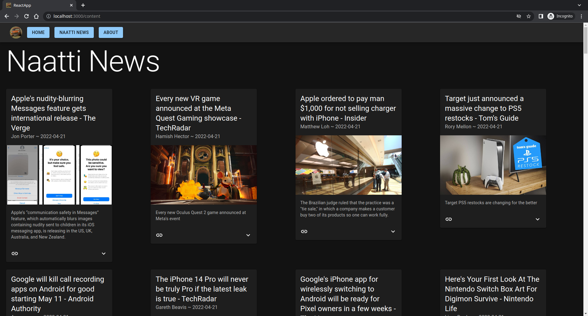

# ReactApp
I'm adding features to this app as learning purposes.



## Running the project

Clone this repository:

```
git clone https://github.com/laineantti/ReactApp.git && cd ReactApp
```

Install packages:

```
npm install
```

When installation is complete, run it:

```
npm start
```

To deploy the app use [gh-pages](https://github.com/gitname/react-gh-pages) with

```
npm run deploy
```